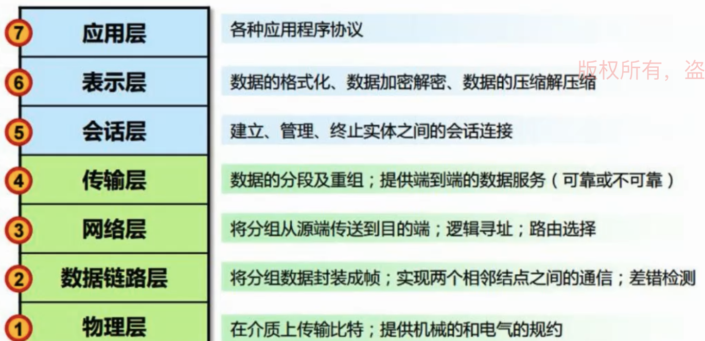

## http

### OSI 七层模型

五层模型：把应用层、表示层、会话层统一叫做应用层

四层模型：把数据链路层和物理层统一叫做物理层

物理层：网线等若干设备

### http 方法

- head

- options: 预检请求，跨域相关。跨域请求分为简单请求和非简单请求，非简单请求，对服务器有修改的请求，才会发预检请求，

### get vs post

get url 有利于缓存结果

post 多次调用，可能会造成多次提交，会有副作用。get 具有幂等性，一般不会有副作用

